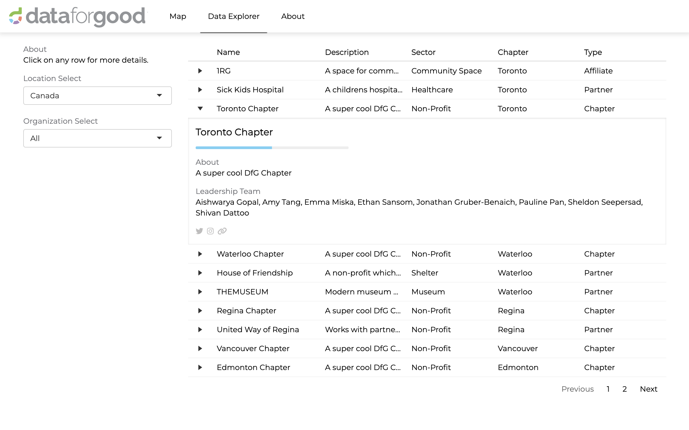

## Data for Good Dashboard
This GitHub contains the code for the [Data for Good Dashboard](https://7wouif-ethan-sansom.shinyapps.io/dfg_dashboard/), a website developed using R Shiny.

[Data for Good](https://dataforgood.ca/) is a non-profit community organization which allows people to use their data science expertise to make the world a better place. We help not for-profit, and non-governmental organizations leverage their data to make data-driven decisions with the help of our talented volunteers, by hosting and organizing DataThons - 24-48 hour weekend event that matches social organizations with volunteer data experts to tackle their data-related challenges.
 
Data for Good began as a single chapter in Toronto, and has since grown nationwide, with chapters in Vancouver, Calgary, Edmonton, Regina, Ottawa, Toronto, Waterloo, and Montreal.

## Data
Currently, the data (including hyperlinks) in this dashboard is a *placeholder*. In practice, the Data for Good dashboard provides information about the Data for Good chapters, including their locations and current leadership teams, and information on Data for Good's Partner and Affiliate organizations.

## Shiny Application

The dashboard is a Shiny application, which heavily utilizes the {reactable} and {leaflet} R packages.

## References
Two excellent resources which made the building of this website possible are:
- Greg Lin's {reactable} package demo, [CRAN Packages](https://glin.github.io/reactable/articles/cran-packages/cran-packages.html)
- Edward Parker and Quentin Leclerc's [COVID-19 Tracker](https://vac-lshtm.shinyapps.io/ncov_tracker/#)

## Author
Ethan Sansom

## Contact
ethan.sansom@dataforgood.ca
